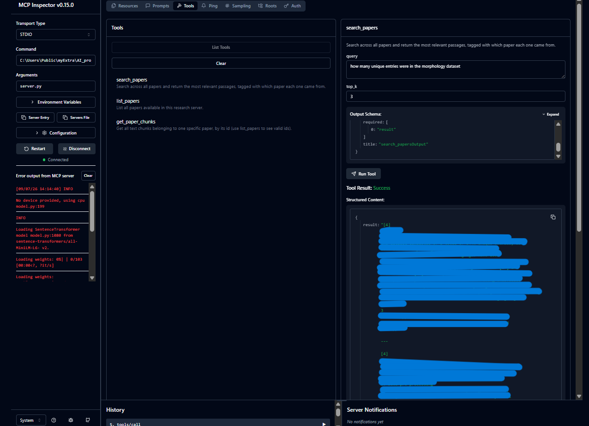
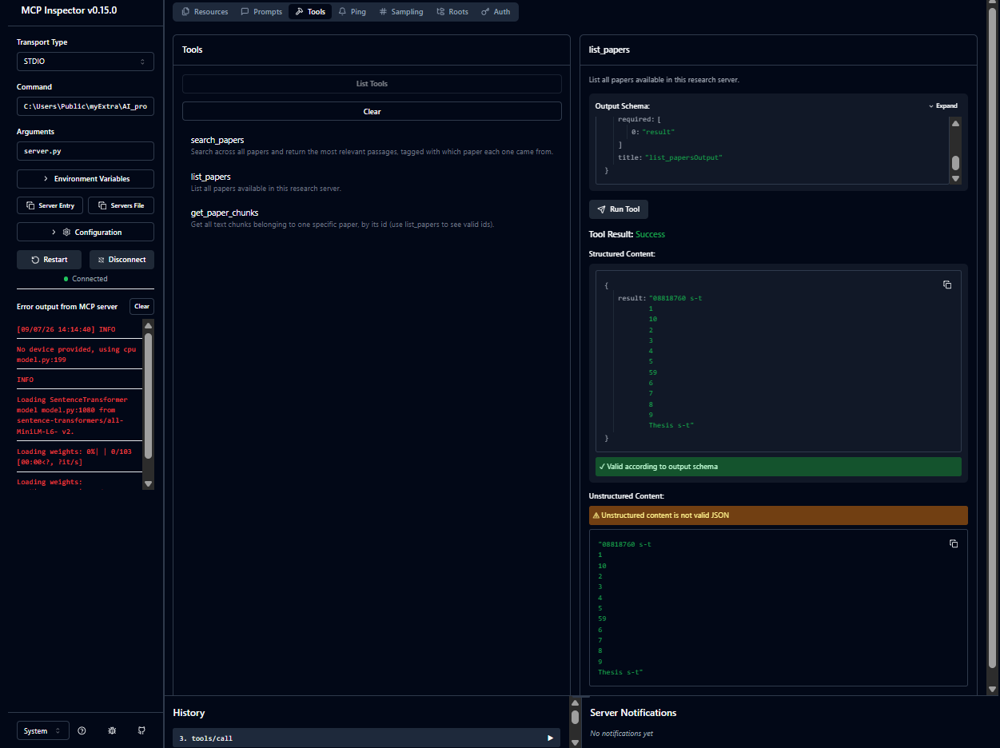
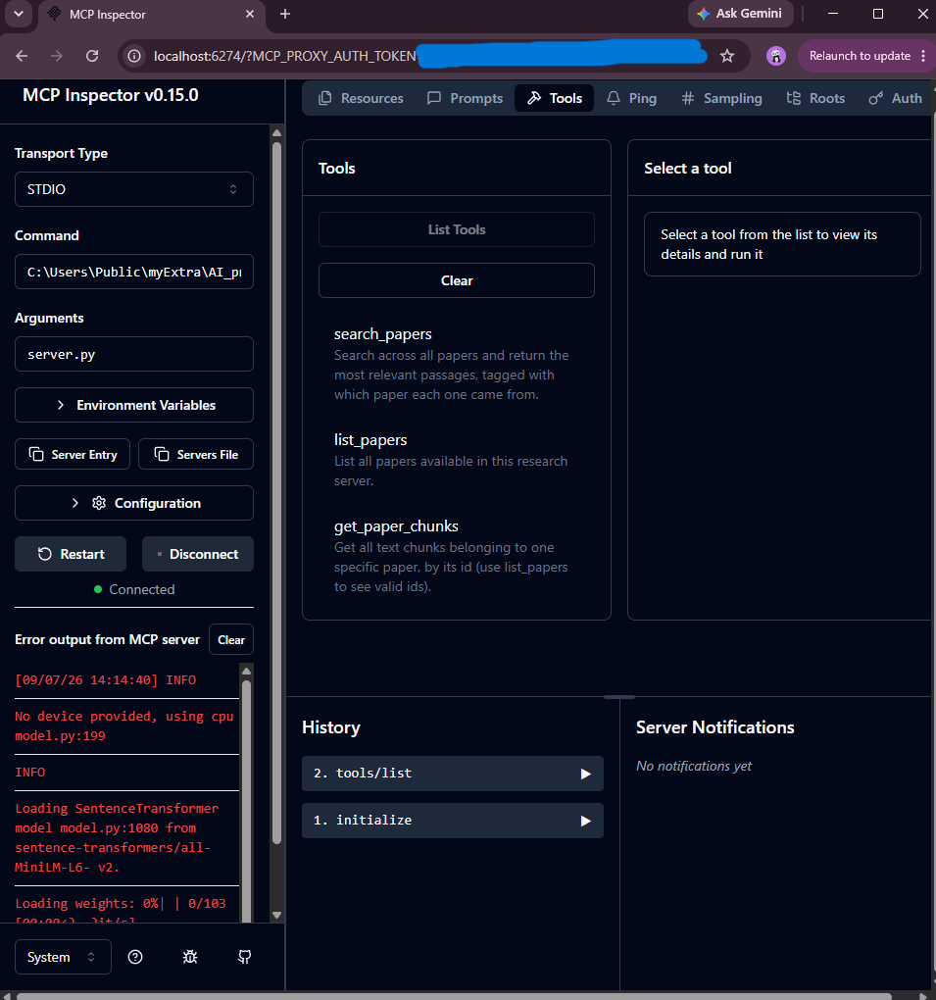
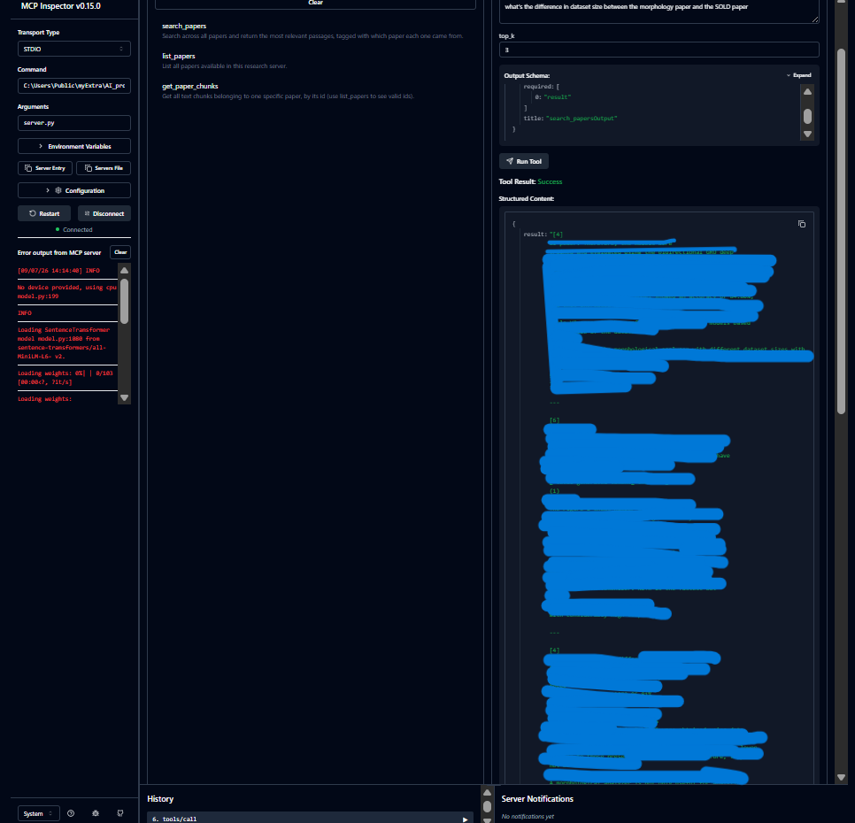
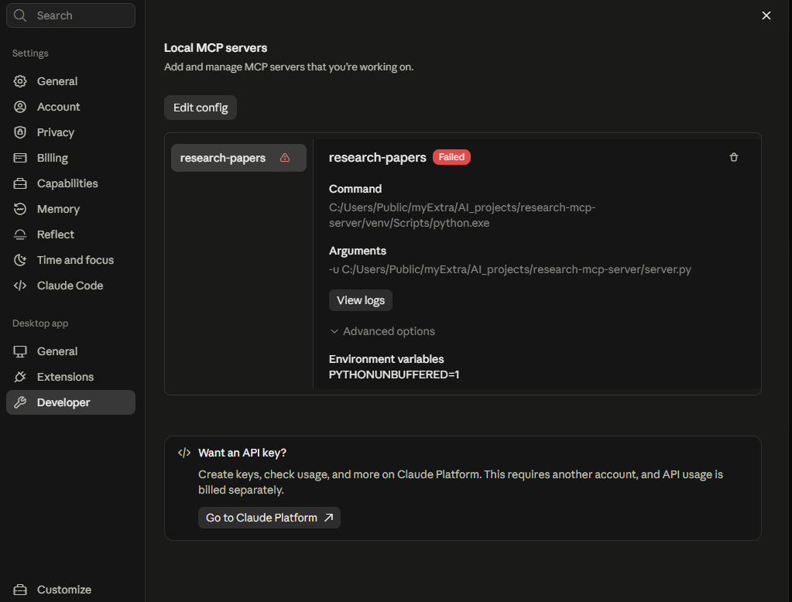
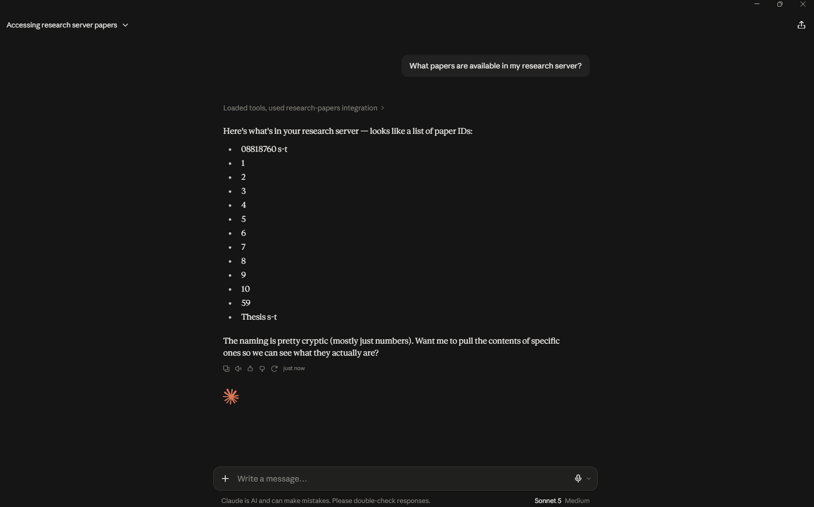
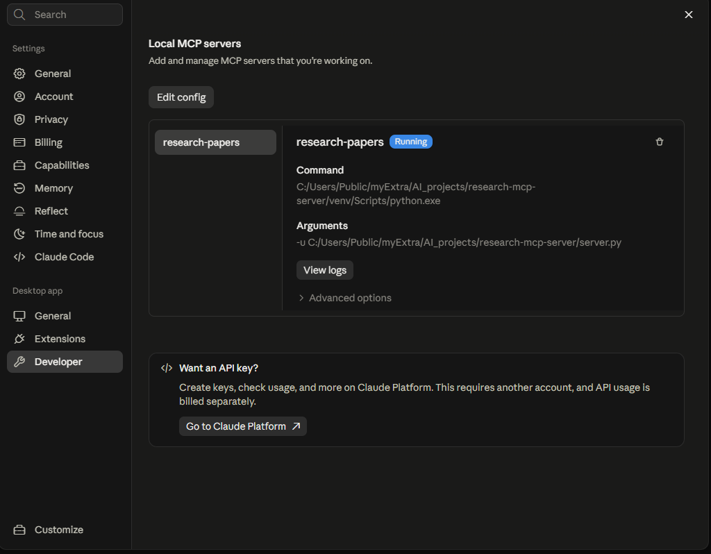
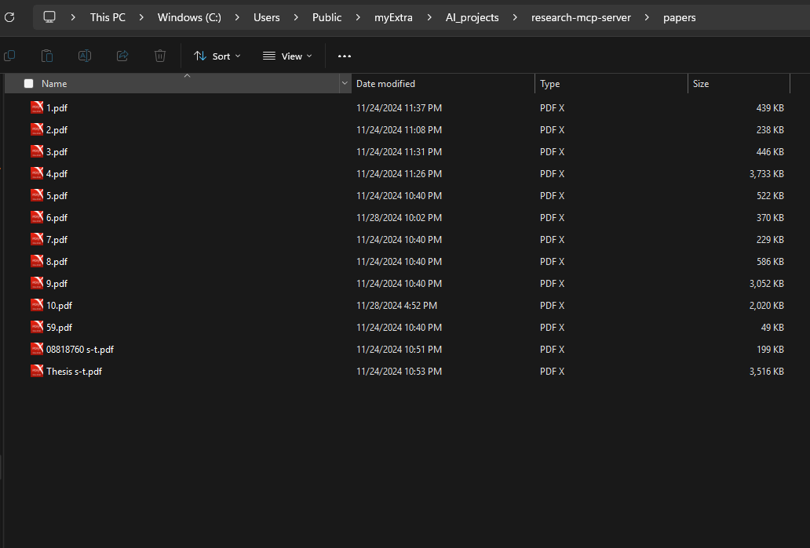
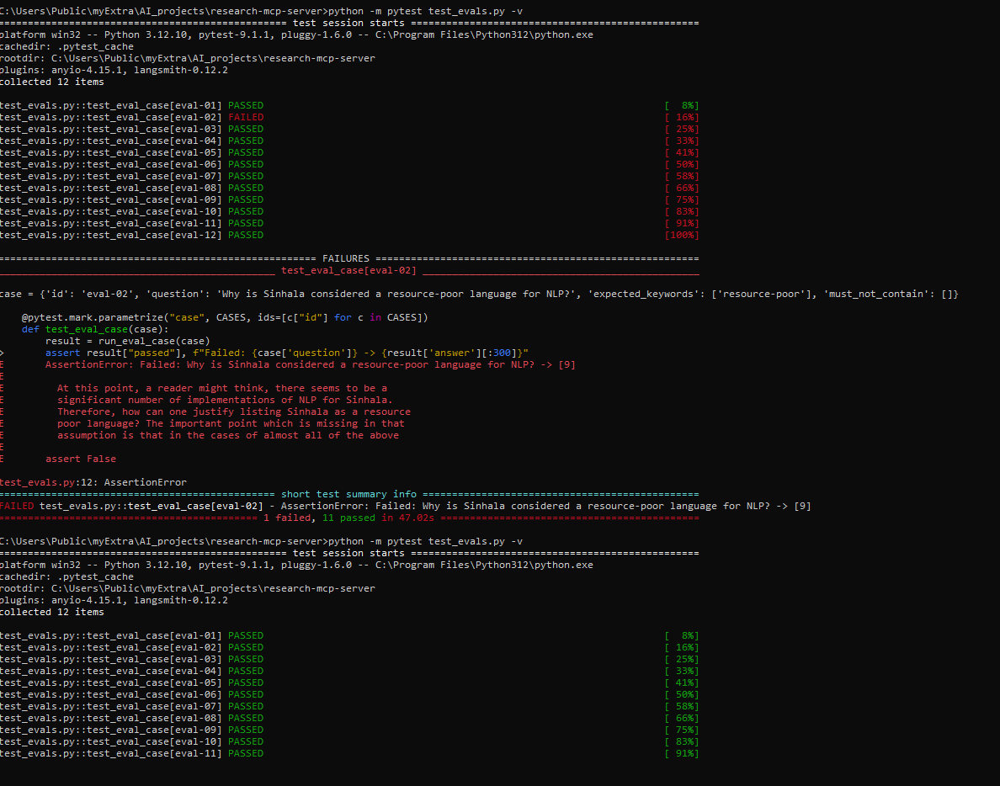

# Research MCP Server

## Step 0 — Prerequisites

```bash
mkdir research-mcp-server
cd research-mcp-server
python -m venv venv
venv\Scripts\activate      # on Mac/Linux: source venv/bin/activate
pip install mcp sentence-transformers chromadb pypdf --break-system-packages
```

## Step 1 — Prepare your data

```bash
mkdir papers   # drop your thesis + paper PDFs in here
python prepare_data.py
```

## Step 2 — Build the searchable vector store

```bash
python build_index.py
```

## Step 3 — Write the MCP server itself

See `server.py`.

`mcp` v2.x renamed `FastMCP` to `MCPServer`. If you're on mcp 2.x, import it like this:

```python
from mcp.server.mcpserver import MCPServer
server = MCPServer("research-papers")
```

not `from mcp.server.fastmcp import FastMCP` — that's the old v1 way and throws `ModuleNotFoundError` on v2.

Don't load the embedding model or chroma client at the top of the file. Load them lazily, inside the tool functions, the first time they're actually used. Claude Desktop expects a reply within ~60s of connecting, and loading torch + sentence-transformers eagerly can take longer than that on a slow/cold machine — the server just sits there and gets marked "Failed" even though nothing's actually wrong with it.

Use absolute paths for the `chroma_store` folder, anchored to the script's own location:

```python
BASE_DIR = os.path.dirname(os.path.abspath(__file__))
CHROMA_PATH = os.path.join(BASE_DIR, "chroma_store")
```

A relative path like `"./chroma_store"` works fine when you run it from your terminal but breaks when Claude Desktop launches it from somewhere else.

## Step 4 — Test it locally before connecting anything

```bash
pip install "mcp[cli]" --break-system-packages
mcp dev server.py
```

Open the Inspector link it gives you and try `list_papers` / `search_papers` there first, before touching Claude Desktop.

## Step 5 — Connect it to Claude Desktop

Open Claude Desktop → **Settings → Developer → Edit config**. This is the config file Desktop actually reads — don't go hunting for `%APPDATA%` yourself, just use this button.

Add:

```json
{
  "mcpServers": {
    "research-papers": {
      "command": "C:/absolute/path/to/research-mcp-server/venv/Scripts/python.exe",
      "args": ["-u", "C:/absolute/path/to/research-mcp-server/server.py"],
      "env": { "PYTHONUNBUFFERED": "1" }
    }
  }
}
```

Use forward slashes even on Windows. Point `command` at the `python.exe` inside your venv, not just `python3`.

Fully quit Claude Desktop from the tray icon (not just close the window), reopen it, then check Settings → Developer again — `research-papers` should say **Running**. If it says **Failed**, click **View logs**.

Then in a new chat ask: *"What papers are available in my research server?"* — Claude should call `list_papers` and answer from the real data.

## Step 6 — Ask it real research questions

- "Does any of my papers use skeletal data, and which one specifically?"
- "Summarize the difference in accuracy reported between paper 2 and paper 4."
- "Which of my papers would be most relevant to someone working on RGB-only gesture recognition?"

Watch for Claude calling `search_papers` before it answers — that's how you know it's actually reading your papers and not just guessing.

## Common problems and fixes

**`ModuleNotFoundError: No module named 'mcp'`**
Venv isn't activated. Run `venv\Scripts\activate` first.

**`ModuleNotFoundError: No module named 'mcp.server.fastmcp'`**
You're on mcp 2.x. Use `MCPServer` instead of `FastMCP` (see Step 3).

**Works in `mcp dev` / the Inspector but fails in Claude Desktop**
Usually a working-directory or env var problem. The Inspector runs your script from inside the project folder, so relative paths and anything you `set` manually in your terminal still apply. Desktop runs it from somewhere else entirely, with none of that. Fix: absolute paths anchored to the script's own folder, and set env vars in the script itself (`os.environ.setdefault(...)`) or in the config's `"env"` block, not just in your terminal session.

**Status shows "Failed" in Settings → Developer, logs don't show an obvious crash**
Look at the timestamps in the logs. If you see `initialize` sent by the client, then nothing, then `notifications/cancelled` about 60 seconds later — that's a timeout, not a crash. Your script accepted the connection but took too long to finish starting up. Fix: lazy-load the model and chroma client instead of loading them at import time (see Step 3).

**"Add custom connector" dialog wants an HTTPS URL**
That's for remote MCP servers, not local ones. A local server like this goes in `claude_desktop_config.json` via Settings → Developer → Edit config, not that dialog.

**Edited `claude_desktop_config.json` by hand at `%APPDATA%\Claude\` but Desktop still doesn't see the server**
If Claude Desktop was installed from the Microsoft Store (MSIX-packaged), it may actually read its config from a different, sandboxed location — something like `%LOCALAPPDATA%\Packages\Claude_<random-id>\LocalCache\Roaming\Claude\claude_desktop_config.json` — not the normal `%APPDATA%\Claude\` path. Editing the wrong file silently does nothing; Desktop just won't see your `mcpServers` block. Avoid this entirely by never guessing the path yourself — always use **Settings → Developer → Edit config** inside Claude Desktop, which opens whichever file it's actually reading.

**`search_papers` returns nothing relevant**
Check `chunks.json` first — if the PDF text extraction looked garbled in Step 1, fix that before touching the server code.

**Chunks cut off mid-sentence**
Normal with fixed-size chunking. If it actually hurts answer quality, switch to splitting on paragraph breaks before falling back to a hard character cut.

**`list_papers` returns weird IDs like `1`, `59`, `08818760 s-t`**
That's just your PDF filenames. Rename the files if you want cleaner names, or pull the real title out of each PDF in `prepare_data.py` instead of using the filename.

## Screenshots

**MCP Inspector — tools connected**


**`list_papers` working in the Inspector**


**`search_papers` working in the Inspector**


**`search_papers` with a different query**


**Claude Desktop — server failed to start**

This happened when the model/DB were loaded eagerly at import time and the `initialize` handshake timed out (see Common problems and fixes above).



**Claude Desktop — server running correctly**

After switching to lazy-loading the model and Chroma client.



**Claude Desktop — answering from real data**


**`papers/` folder**



## Eval suite (added after the fact)


Went back and added an actual automated eval suite to this instead of just eyeballing
whether the search results looked right. Same idea as test-driven development, just
applied to retrieval instead of regular code - write down what "correct" looks like
first, then run it on every push so nothing silently breaks later.

### What it actually checks

`search_papers` in `server.py` returns raw retrieved passages, not a generated answer -
so this is testing retrieval quality (did the right content come back for a given
question), not whether some LLM answered correctly. Simpler than a full generation eval,
but it's the layer everything else depends on, and it's free and deterministic to test
since there's no LLM call involved at all.

### Files

- `eval_cases.json` - 12 cases: 11 questions that should pull specific known content
  out of the indexed papers, plus 1 totally unrelated question to check the retriever
  doesn't fake a confident match on something not in the corpus at all
- `run_evals.py` - runs each case, checks the expected keywords show up and the
  forbidden ones don't
- `test_evals.py` - same thing as a pytest suite so it plugs into CI
- `.github/workflows/evals.yml` - installs deps, rebuilds the vector index, runs the
  suite, on every push/PR

### Proving it actually catches something

Dropped `n_results=3` down to `n_results=1` in `search_papers` on purpose and reran the
suite locally - `eval-02` failed straight away because the chunk containing
"resource-poor" got pushed out of the smaller result set. The failure message shows
exactly why: the returned chunk talks around the concept but the literal phrase isn't in
it anymore. Put it back to 3, reran, 12/12 again.



### Getting it working in CI (this took a few tries)

First CI run failed immediately - every single case errored out with
`chromadb.errors.NotFoundError: Collection [research_papers] does not exist`. Turned out
`chroma_store/` (the actual vector database) is in `.gitignore`, which makes sense since
it's generated binary data, but it meant a fresh checkout on GitHub's runner had nothing
to query at all. It worked locally purely because my own machine already had a
`chroma_store` sitting there from running `build_index.py` ages ago.

Fixed it by making CI rebuild the index itself before running tests, from `chunks.json`
(the intermediate JSON output of `prepare_data.py`, small and plain text, safe to
commit). Except `chunks.json` was *also* being caught by `.gitignore` - had to pull it
out of the ignore list and explicitly track it. Added one line to the workflow
(`python build_index.py` before pytest) and it built the index fresh and all 12 cases
passed on the actual runner.

Kept `papers/` (the raw PDFs) and `chroma_store/` (the generated DB) out of git - no
reason to commit those - but `chunks.json` now stays tracked specifically so CI has
something to rebuild from without needing the original PDFs at all.

### Setup

```bash
pip install -r requirements.txt
python build_index.py
python -m pytest test_evals.py -v
```

(had to use `python -m pytest` instead of a bare `pytest` locally since the installed
script wasn't on my Windows PATH - works fine either way)

`server.py` sets `HF_HUB_OFFLINE=1` by default so Claude Desktop doesn't try to phone
home to Hugging Face on startup, but GitHub Actions needs to actually download the
embedding model the first time, so the workflow overrides that env var back to `"0"`.

### Honest limitation

Keyword matching is blunt - a correct answer phrased differently would fail this, and a
wrong answer that happens to contain the right words would pass. Good enough to prove
the whole pipeline works end to end though. If I build on this more, next step is
swapping the keyword check for an LLM-as-judge call that actually reads the retrieved
content and decides if it's relevant, instead of doing string matching.
